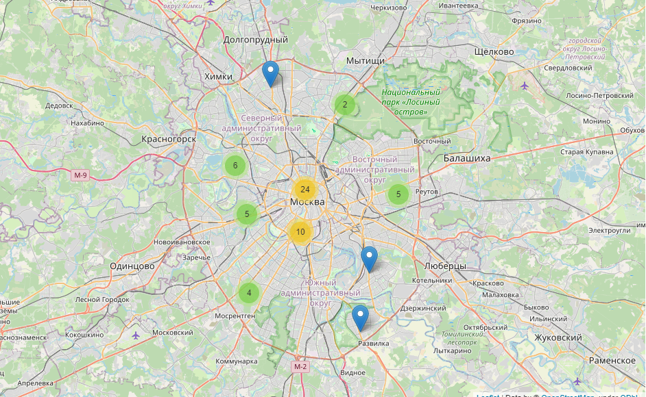

# foodAnalyses
 
## Название проекта: 
Исследования рынка общепита в Москве для принятия решения об открытии нового заведения

## Задачи проекта: 
Исследование рынка общественного питания на основе открытых данных, подготовка презентации

## Используемые инструменты: 
Pandas, Python, Seaborn, Plotly

## Итог: 
Подготовлено исследование рынка на основе открытых данных о заведениях общественного питания Москвы, визуализированы полученные данные. На основе данных выбрано место для открытия новой кофейни

